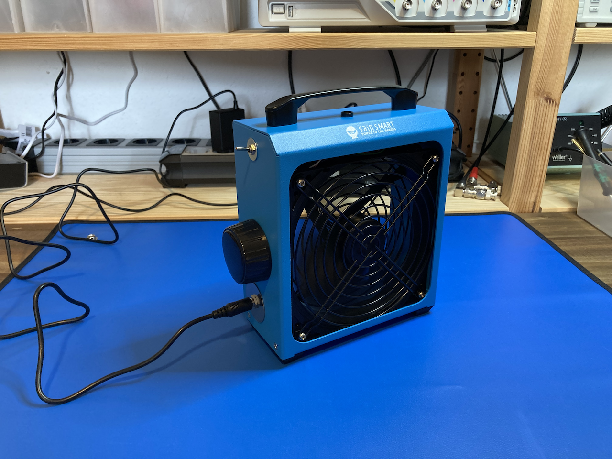
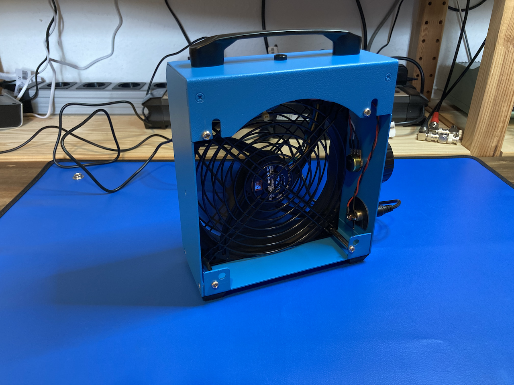
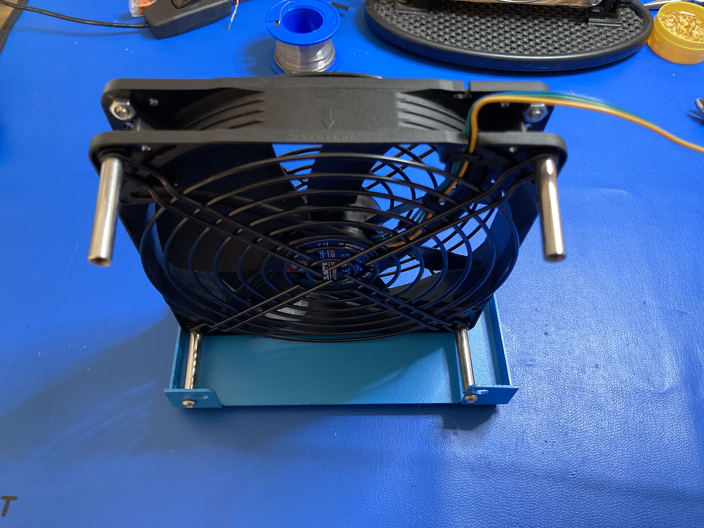
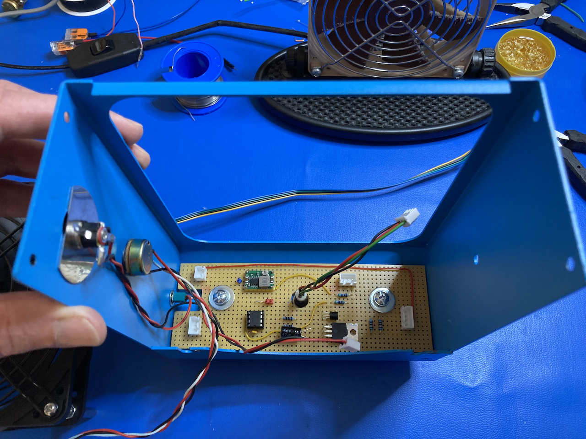

# SainSmart solder fume extractor modification

This project is about replacing the default AC fan in the [SainSmart solder fume extractor](https://www.sainsmart.com/products/sainsmart-solder-smoke-absorber-remover-fume-extractor-for-soldering) with a DC fan like [Noctua NF-A14](https://www.noctua.at/en/products/nf-a14-industrialppc-3000-pwm).

## Why?

- the built-in fan is way too loud
- it runs at constant speed only
- the power cable is way too stiff

## What?

- toggle switch to power the device on or off integrated in the housing
- dual LED to indicate power on and standby
- MOSFET switch to turn the fan on or off using MCU
- pot with a large knob 🫠 to select the fan speed

# How?

